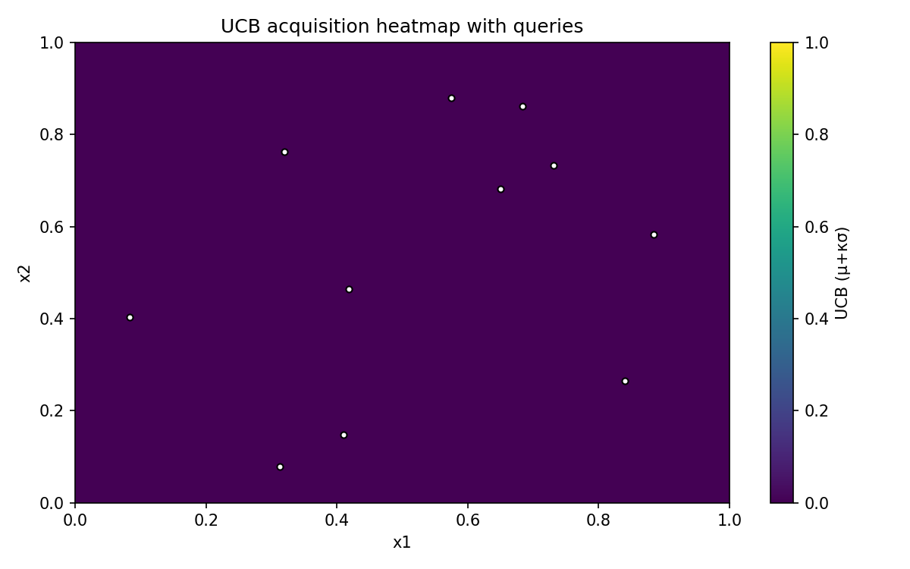
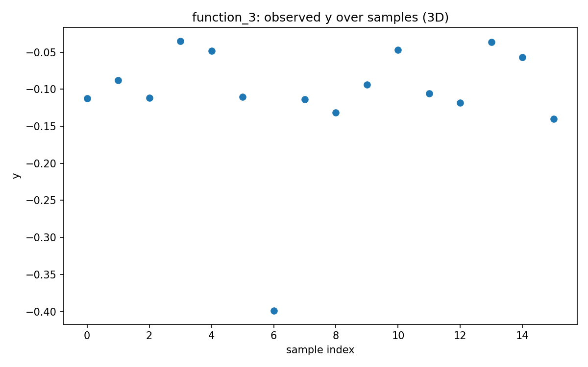
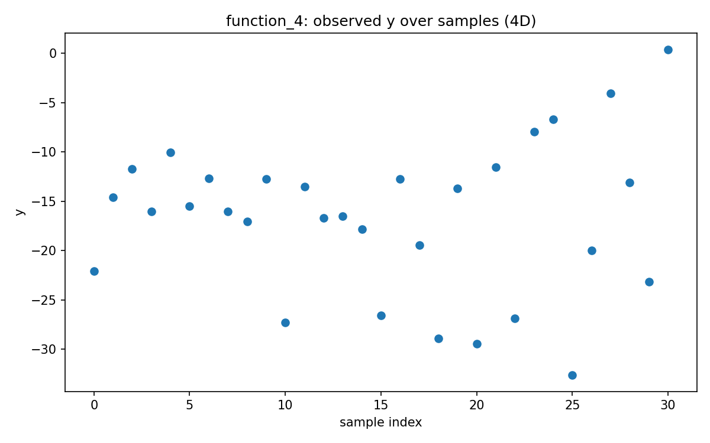
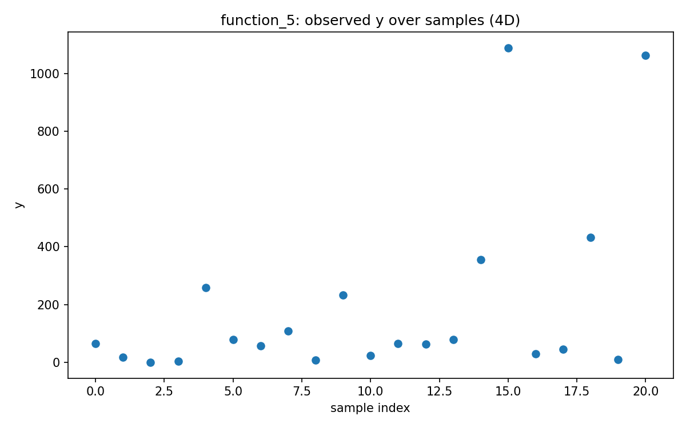
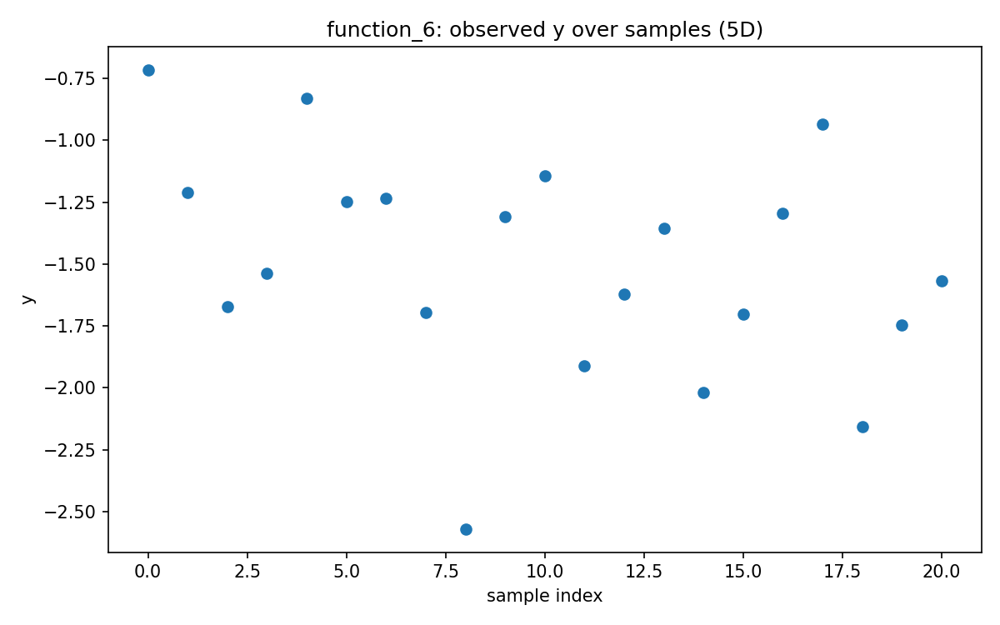
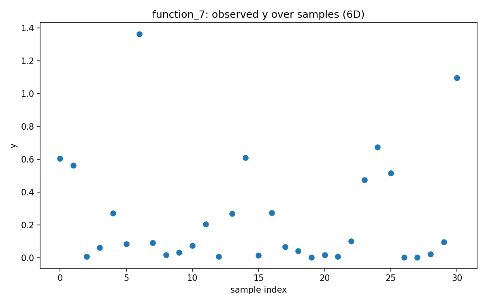
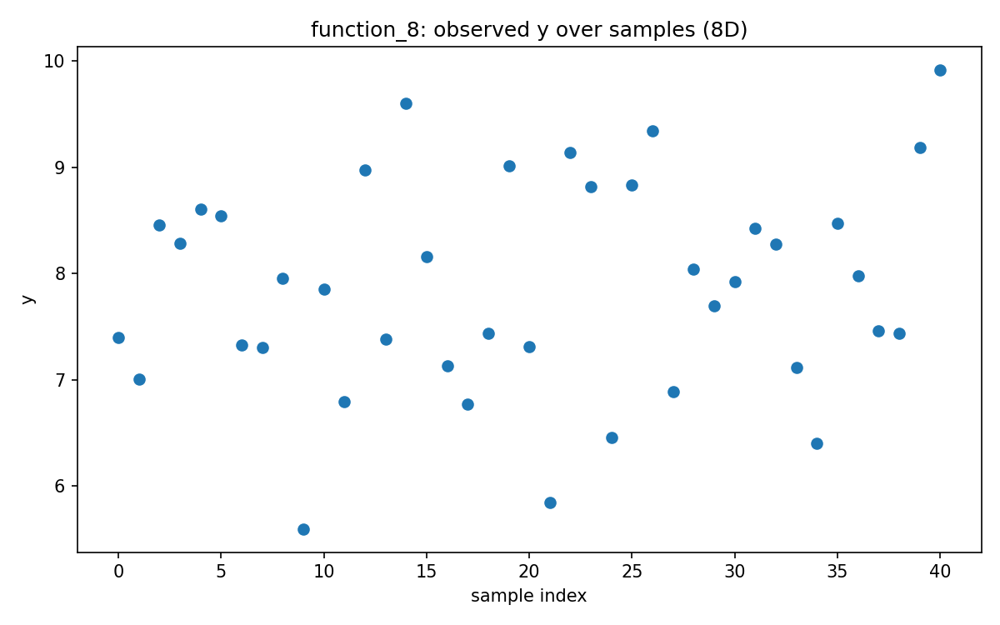

# Week 01 Reflection — Post-Results

## What the latest results taught us
- **Method:** gp_ucb_week1 | Phase: **early**
- First week with results — baseline established.
- Per-function Δbest vs prior best:
  - function_1: baseline established (no prior week)
  - function_2: baseline established (no prior week)
  - function_3: baseline established (no prior week)
  - function_4: baseline established (no prior week)
  - function_5: baseline established (no prior week)
  - function_6: baseline established (no prior week)
  - function_7: baseline established (no prior week)
  - function_8: baseline established (no prior week)

## Function-by-function visuals
- **function_1** — query leaned **exploitation** (μ≈-0.0067, σ≈0.0009, κ·σ ratio≈0.24)
  - x: `0.417608-0.464232`
  
  
- **function_2** — query leaned **exploitation** (μ≈0.4455, σ≈0.0973, κ·σ ratio≈0.35)
  - x: `0.913510-0.346574`
  
  
- **function_3** — query leaned **exploitation** (μ≈-0.1402, σ≈0.0004, κ·σ ratio≈0.01)
  - x: `0.951931-0.189501-0.750476`
  
  
- **function_4** — query leaned **exploitation** (μ≈0.4043, σ≈0.0001, κ·σ ratio≈0.00)
  - x: `0.404566-0.434204-0.379440-0.430063`
  
  
- **function_5** — query leaned **exploitation** (μ≈1021.7573, σ≈92.2490, κ·σ ratio≈0.21)
  - x: `0.298737-0.090499-0.915960-0.998558`
  
  
- **function_6** — query leaned **exploitation** (μ≈-1.5683, σ≈0.0000, κ·σ ratio≈0.00)
  - x: `0.090880-0.105858-0.481316-0.925372-0.339325`
  
  
- **function_7** — query leaned **exploitation** (μ≈1.0973, σ≈0.0120, κ·σ ratio≈0.03)
  - x: `0.705487-0.830142-0.790573-0.142321-0.140510-0.737190`
  
  
- **function_8** — query leaned **exploitation** (μ≈9.9190, σ≈0.0000, κ·σ ratio≈0.00)
  - x: `0.061672-0.524578-0.038162-0.098349-0.865492-0.163241-0.040732-0.633010`
  
  

## Strategy for the next round
- Baseline established; keep κ moderately high and maintain diversity in near-ties.

*Signals to monitor next:* posterior σ maps, learned length-scales, near-tie diversity.

*Auto-generated on 2025-10-19 22:50 UTC*