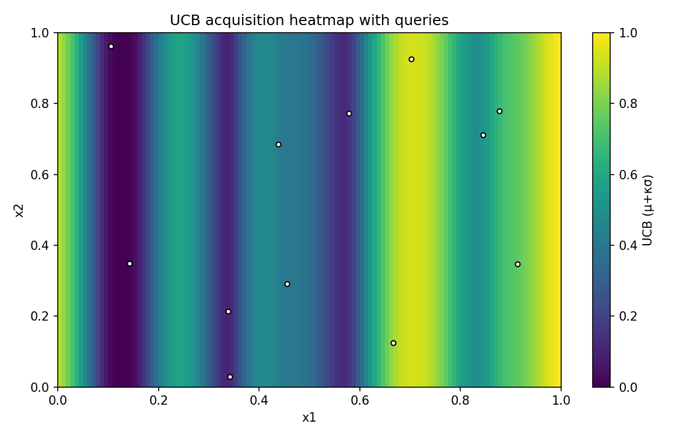
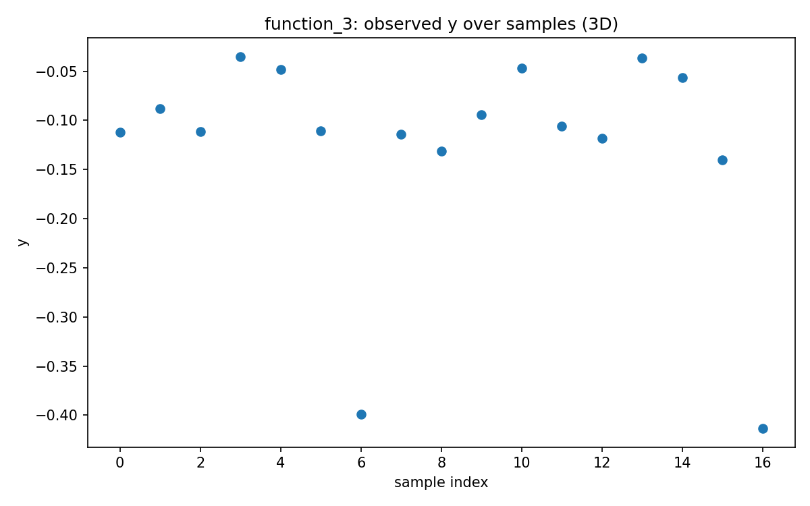
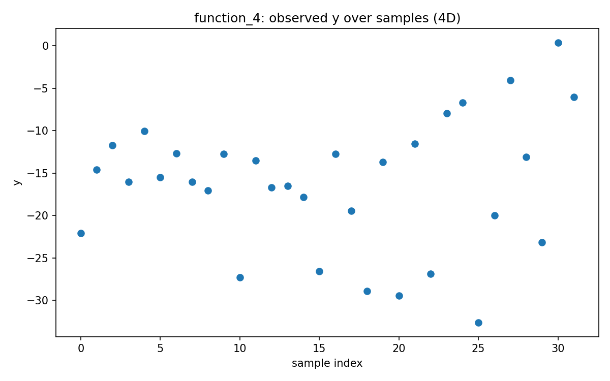
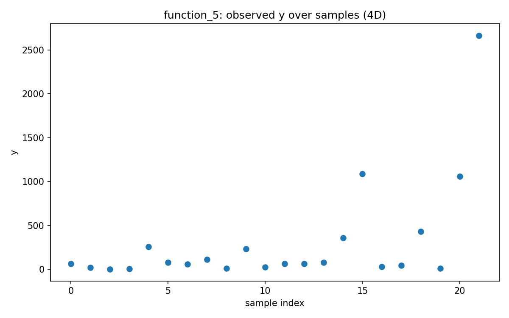
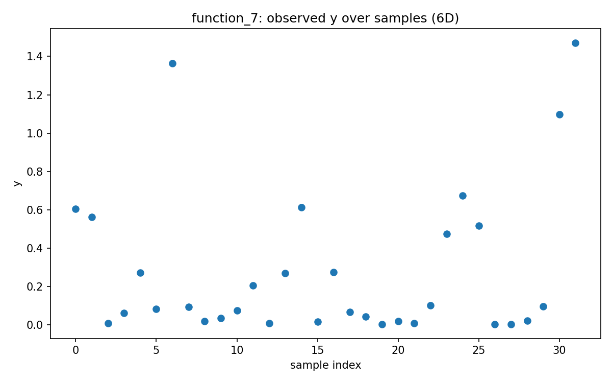
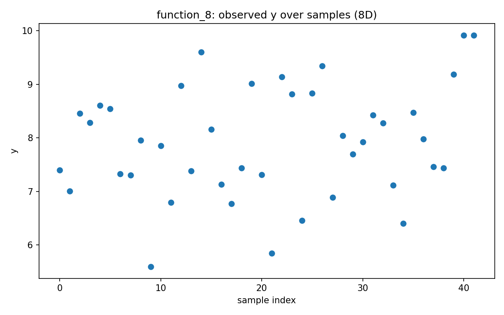

# Week 02 Reflection — Post-Results

## What the latest results taught us
- **Method:** gp_ucb_week2 | Phase: **early**
- Mean Δbest across functions: **+199.9874**; improved on **62%** of functions.
- Per-function Δbest vs prior best:
  - function_1: Δbest=+0.0072
  - function_2: Δbest=-0.5269
  - function_3: Δbest=-0.2733
  - function_4: Δbest=-6.4059
  - function_5: Δbest=+1605.5778
  - function_6: Δbest=+1.1462
  - function_7: Δbest=+0.3738
  - function_8: Δbest=+0.0000

## Function-by-function visuals
- **function_1** — query leaned **exploration** (μ≈-0.0000, σ≈0.0006, κ·σ ratio≈0.98)
  - x: `0.051347-0.919882`
  
  
- **function_2** — query leaned **exploration** (μ≈-0.0585, σ≈0.0348, κ·σ ratio≈0.59)
  - x: `0.104600-0.962268`
  
  
- **function_3** — query leaned **exploitation** (μ≈-0.4134, σ≈0.0026, κ·σ ratio≈0.02)
  - x: `0.999076-0.927113-0.985076`
  
  
- **function_4** — query leaned **exploitation** (μ≈-6.0016, σ≈0.0005, κ·σ ratio≈0.00)
  - x: `0.477097-0.434448-0.136061-0.471890`
  
  
- **function_5** — query leaned **exploitation** (μ≈2667.0681, σ≈0.0982, κ·σ ratio≈0.00)
  - x: `0.861962-0.856128-0.933518-0.866172`
  
  
- **function_6** — query leaned **exploitation** (μ≈-0.4222, σ≈0.0023, κ·σ ratio≈0.02)
  - x: `0.450600-0.291765-0.538896-0.991996-0.106024`
  
  
- **function_7** — query leaned **exploitation** (μ≈1.4717, σ≈0.0001, κ·σ ratio≈0.00)
  - x: `0.112911-0.267073-0.640314-0.482888-0.421507-0.790965`
  
  
- **function_8** — query leaned **exploitation** (μ≈9.9190, σ≈0.0001, κ·σ ratio≈0.00)
  - x: `0.141204-0.061199-0.050907-0.027400-0.808719-0.437583-0.249977-0.080856`
  
  

## Strategy for the next round
- Positive average Δbest; continue TR refinement where gains persist.
- For laggards (Δbest ≤ 0), raise κ by ~0.2 and widen candidate sampling by ~25%.

*Signals to monitor next:* posterior σ maps, learned length-scales, near-tie diversity.

*Auto-generated on 2025-10-28 23:13 UTC*