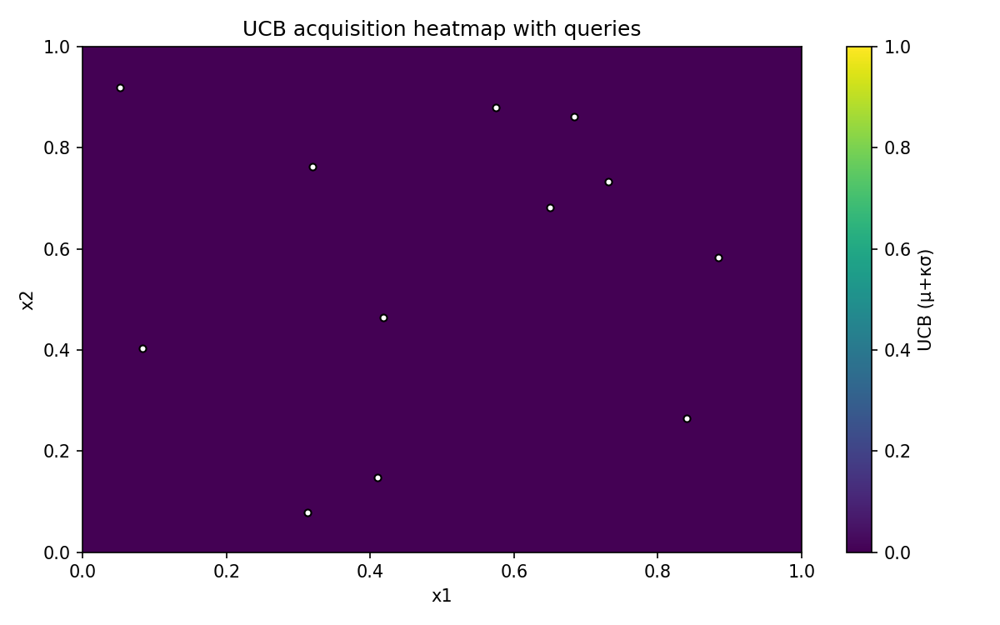
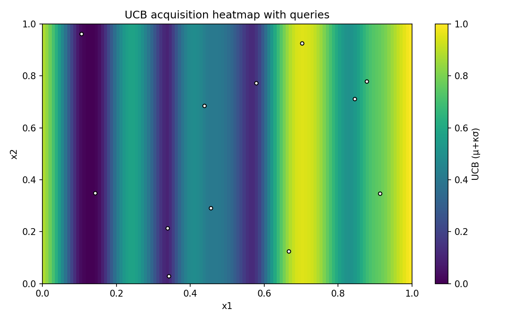
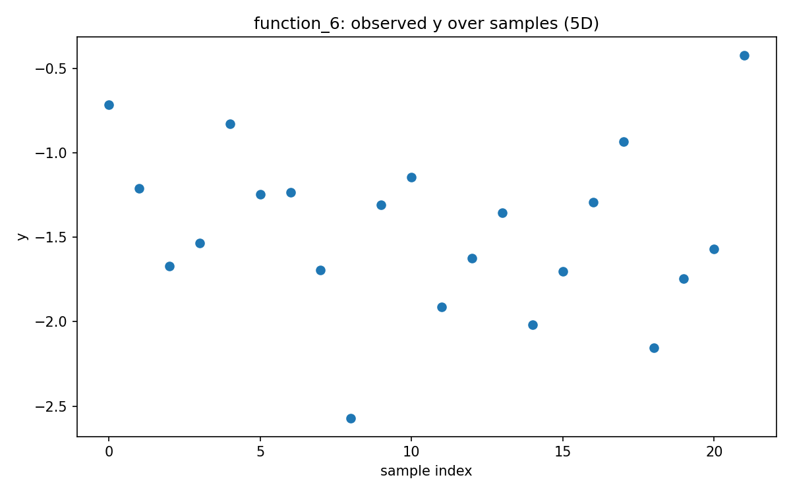

# Week 03 Reflection — Pre-Results

## Method / Principle
- **Method:** gp_ucb_week3
- Phase: **early**, κ is higher to bias exploration into uncertain regions.
- Acquisition: **UCB = μ + κ·σ**; early weeks bias exploration; near-tie candidates use a **diversity (max-min distance)** rule.

## Function-by-function (current proposal rationale)
- **function_1** — query leaned **exploration** (μ≈-0.0009, σ≈0.0021, κ·σ ratio≈0.85)
  - x: `0.011778-0.098856`
  
  
- **function_2** — query leaned **exploitation** (μ≈0.6092, σ≈0.0333, κ·σ ratio≈0.11)
  - x: `0.698458-0.483769`
  
  
- **function_3** — query leaned **exploration** (μ≈-0.1271, σ≈0.1070, κ·σ ratio≈0.66)
  - x: `0.414407-0.971724-0.859043`
  
  
- **function_4** — query leaned **exploration** (μ≈-0.1552, σ≈0.5206, κ·σ ratio≈0.91)
  - x: `0.314577-0.409564-0.497973-0.426633`
  
  
- **function_5** — query leaned **exploitation** (μ≈2417.8557, σ≈186.9839, κ·σ ratio≈0.18)
  - x: `0.761555-0.572955-0.938692-0.997177`
  
  
- **function_6** — query leaned **exploration** (μ≈-0.7786, σ≈0.3399, κ·σ ratio≈0.55)
  - x: `0.395401-0.602781-0.013844-0.947784-0.056102`
  
  
- **function_7** — query leaned **exploitation** (μ≈1.1851, σ≈0.2422, κ·σ ratio≈0.39)
  - x: `0.957944-0.838615-0.311262-0.594857-0.545512-0.784125`
  
  
- **function_8** — query leaned **exploitation** (μ≈9.1572, σ≈0.3875, κ·σ ratio≈0.12)
  - x: `0.143742-0.932666-0.006846-0.893434-0.992751-0.291804-0.154747-0.033410`
  
  

## Challenging functions & info gaps
- Higher-dimensional functions (d ≥ 5): 6, 7, 8 — hardest due to sparse coverage and possible anisotropy.
- Helpful info: approximate noise levels/replicates, domain constraints, tighter feature bounds if known.

## Plan for the next round
- Keep κ moderately high; expand candidate pool in sparse/uncertain functions.
- Maintain near-tie diversity to avoid redundant sampling.

*Auto-generated on 2025-10-30 22:53 UTC*