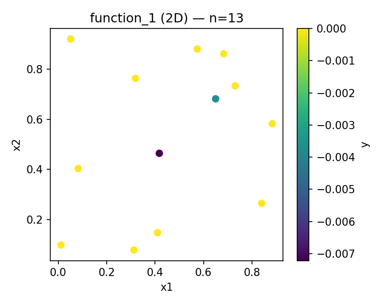
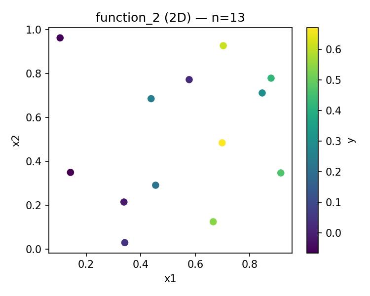
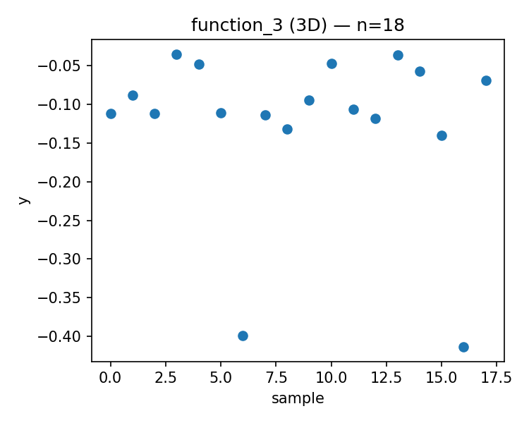
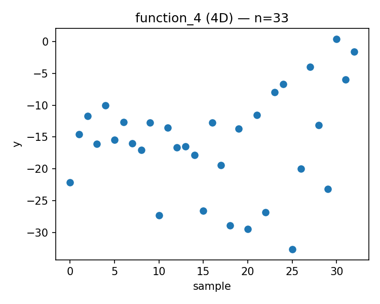
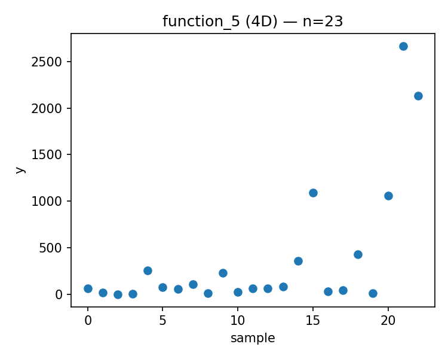
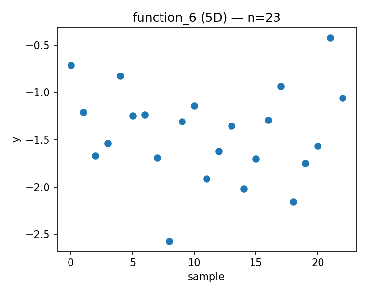
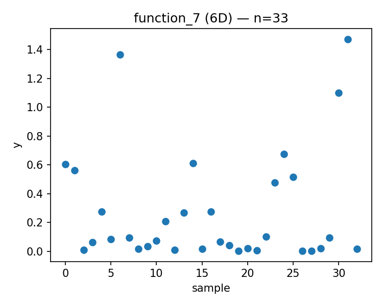
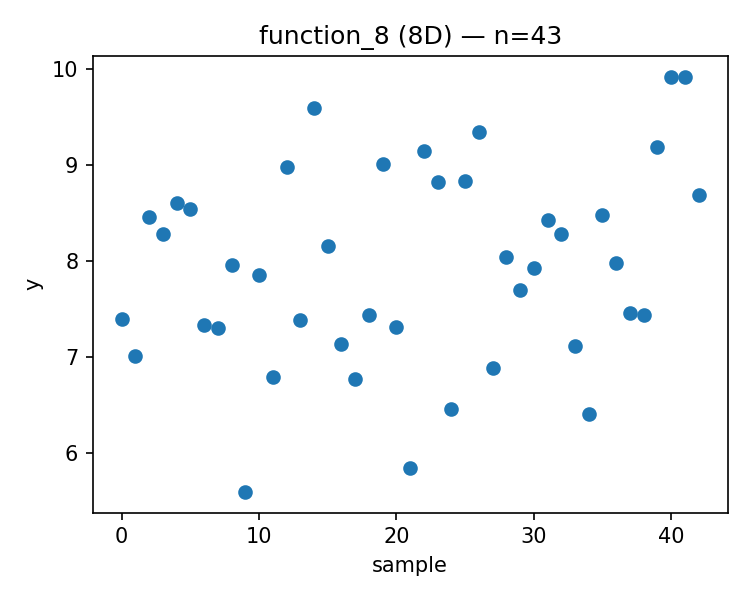

# Week 04 Report

Generated: 2025-11-04 01:25:04

## Proposed Points

### Function 1 (d=2, n=13)
- Current best: y = 0.000000
- Proposed x = [0.618157, 0.340454]
- 

### Function 2 (d=2, n=13)
- Current best: y = 0.670774
- Proposed x = [0.726619, 0.302808]
- 

### Function 3 (d=3, n=18)
- Current best: y = -0.034835
- Proposed x = [0.993604, 0.966569, 0.089141]
- 

### Function 4 (d=4, n=33)
- Current best: y = 0.404303
- Proposed x = [0.423248, 0.386267, 0.390484, 0.433815]
- 

### Function 5 (d=4, n=23)
- Current best: y = 2667.068188
- Proposed x = [0.851623, 0.861045, 0.909974, 0.963665]
- 

### Function 6 (d=5, n=23)
- Current best: y = -0.422192
- Proposed x = [0.922869, 0.363636, 0.046675, 0.813388, 0.889347]
- 

### Function 7 (d=6, n=33)
- Current best: y = 1.471711
- Proposed x = [0.065720, 0.775227, 0.338682, 0.595745, 0.559790, 0.767233]
- 

### Function 8 (d=8, n=43)
- Current best: y = 9.919041
- Proposed x = [0.049180, 0.530952, 0.090076, 0.060897, 0.911918, 0.953250, 0.053290, 0.930045]
- 

---

## Strategy Notes

See `strategy_overrides.json` for adaptive strategy parameters.
