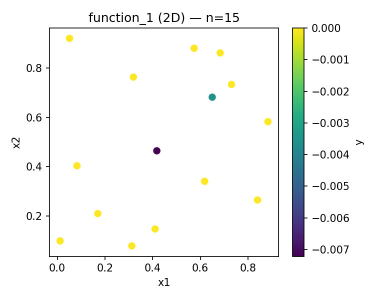
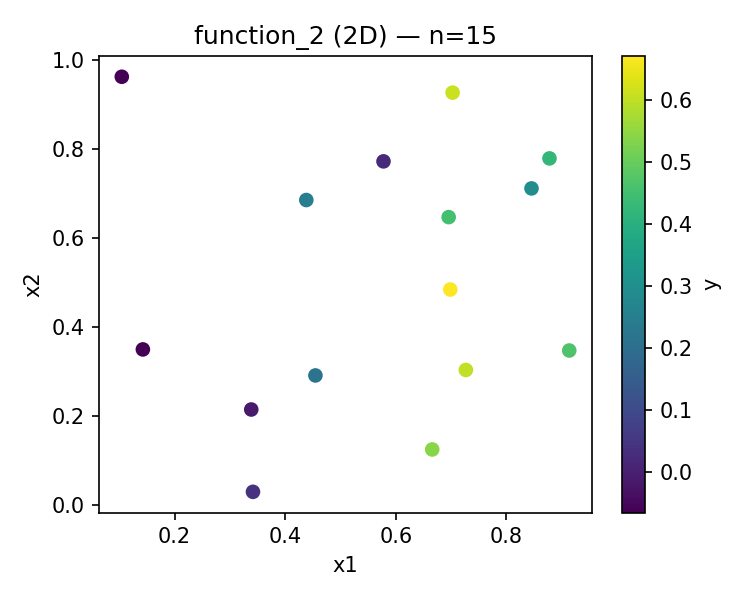
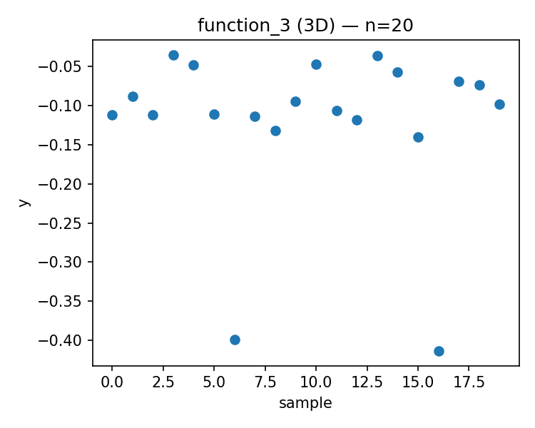
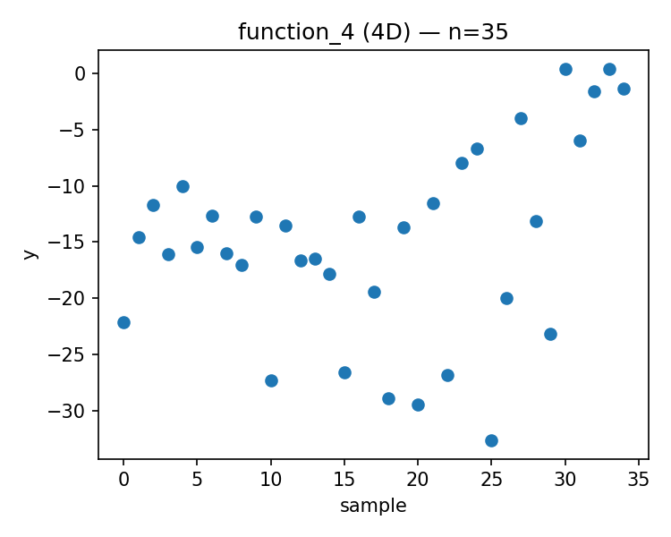
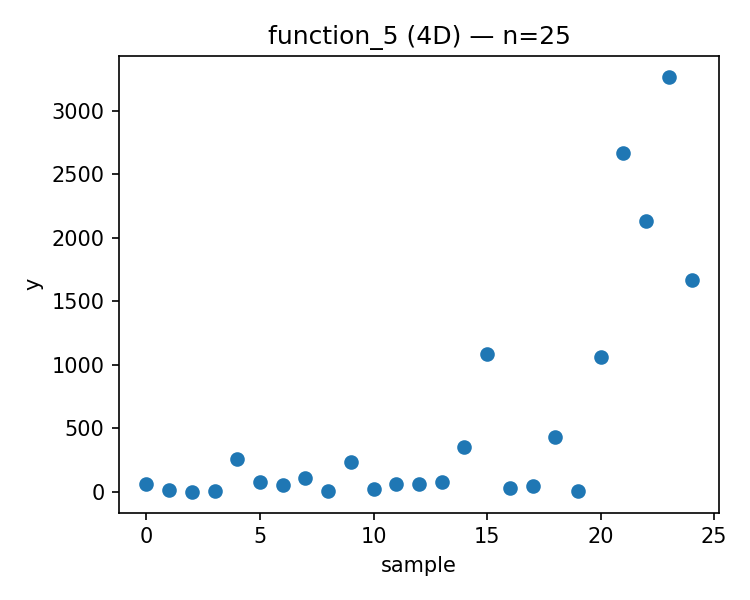
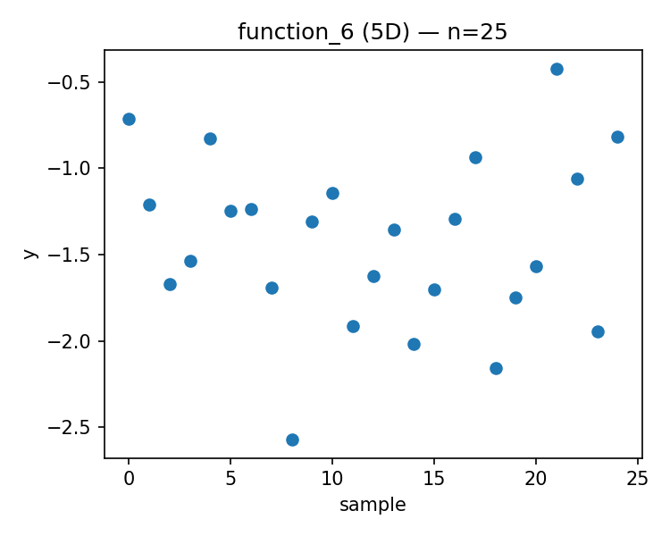
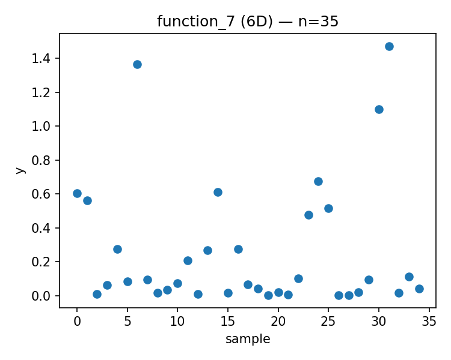
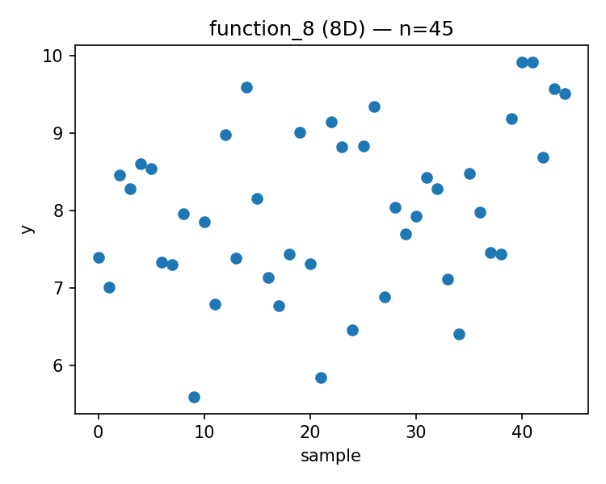

# Week 06 Report

Generated: 2025-11-13 23:25:11

## Proposed Points

### Function 1 (d=2, n=15)
- Current best: y = 0.000000
- Proposed x = [0.259334, 0.373666]
- 

### Function 2 (d=2, n=15)
- Current best: y = 0.670774
- Proposed x = [0.719005, 0.786356]
- 

### Function 3 (d=3, n=20)
- Current best: y = -0.034835
- Proposed x = [0.559867, 0.200444, 0.570876]
- 

### Function 4 (d=4, n=35)
- Current best: y = 0.404303
- Proposed x = [0.399034, 0.380568, 0.405463, 0.409768]
- 

### Function 5 (d=4, n=25)
- Current best: y = 3269.422228
- Proposed x = [0.857935, 0.860657, 0.937629, 0.993839]
- 

### Function 6 (d=5, n=25)
- Current best: y = -0.422192
- Proposed x = [0.067132, 0.491202, 0.139299, 0.058796, 0.013307]
- 

### Function 7 (d=6, n=35)
- Current best: y = 1.471711
- Proposed x = [0.957325, 0.130401, 0.904393, 0.857179, 0.596910, 0.790564]
- 

### Function 8 (d=8, n=45)
- Current best: y = 9.919041
- Proposed x = [0.159107, 0.003995, 0.341134, 0.038762, 0.894072, 0.558877, 0.136361, 0.812578]
- 

---

## Strategy Notes

See `strategy_overrides.json` for adaptive strategy parameters.
