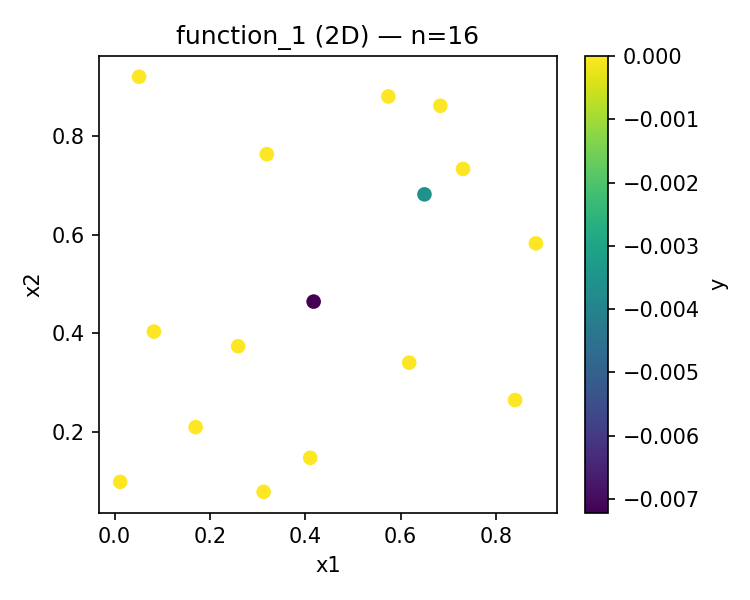
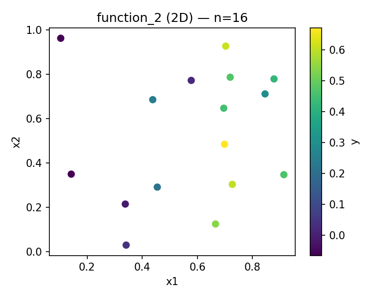
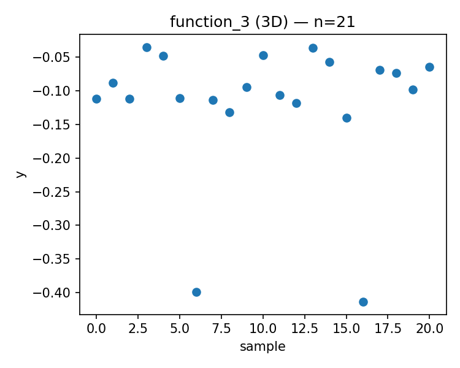
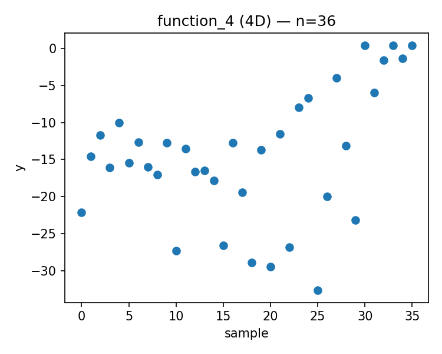
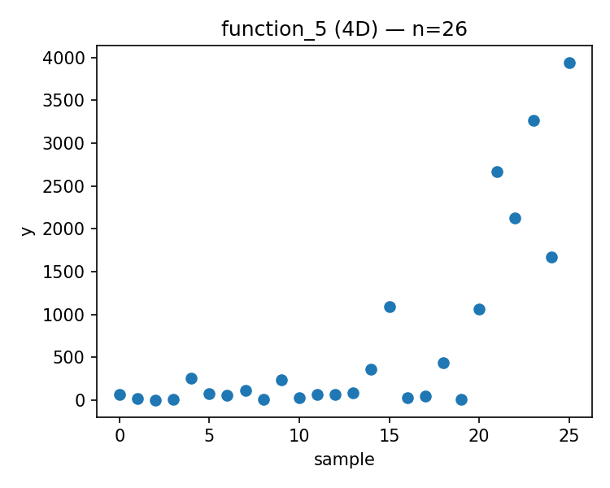
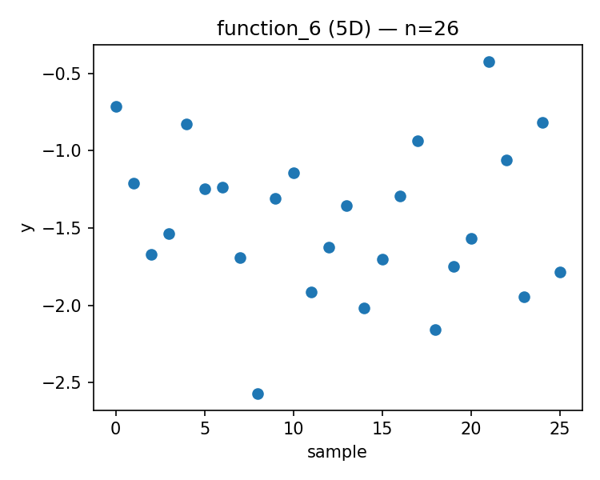
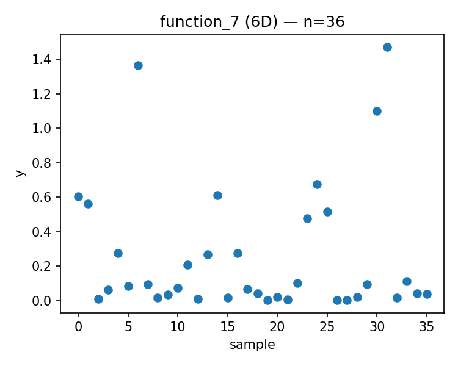
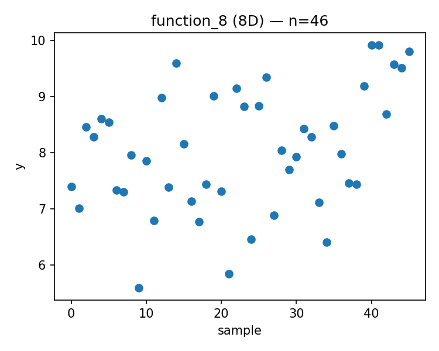

# Week 07 Report

Generated: 2025-11-18 00:22:36

## Proposed Points

### Function 1 (d=2, n=16)
- Current best: y = 0.000000
- Proposed x = [0.191487, 0.546928]
- 

### Function 2 (d=2, n=16)
- Current best: y = 0.670774
- Proposed x = [0.713001, 0.029729]
- 

### Function 3 (d=3, n=21)
- Current best: y = -0.034835
- Proposed x = [0.069505, 0.823813, 0.989632]
- 

### Function 4 (d=4, n=36)
- Current best: y = 0.404303
- Proposed x = [0.954392, 0.111012, 0.054271, 0.173241]
- 

### Function 5 (d=4, n=26)
- Current best: y = 3942.095977
- Proposed x = [0.837156, 0.860172, 0.935128, 0.994487]
- 

### Function 6 (d=5, n=26)
- Current best: y = -0.422192
- Proposed x = [0.238077, 0.130826, 0.613957, 0.935428, 0.009016]
- 

### Function 7 (d=6, n=36)
- Current best: y = 1.471711
- Proposed x = [0.200339, 0.698461, 0.855500, 0.074063, 0.363231, 0.816573]
- 

### Function 8 (d=8, n=46)
- Current best: y = 9.919041
- Proposed x = [0.078042, 0.231466, 0.271287, 0.099880, 0.990273, 0.213353, 0.054554, 0.988066]
- 

---

## Strategy Notes

See `strategy_overrides.json` for adaptive strategy parameters.
