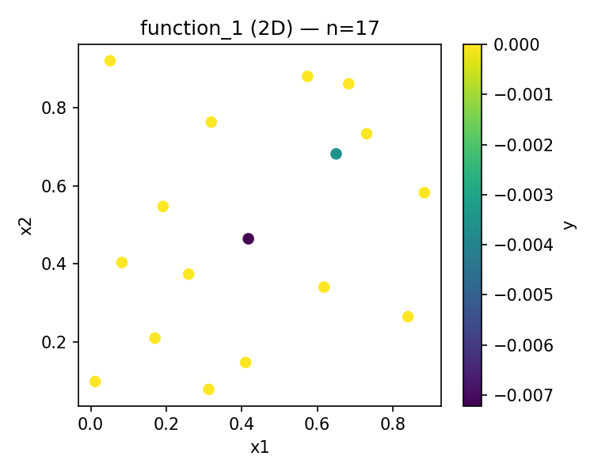
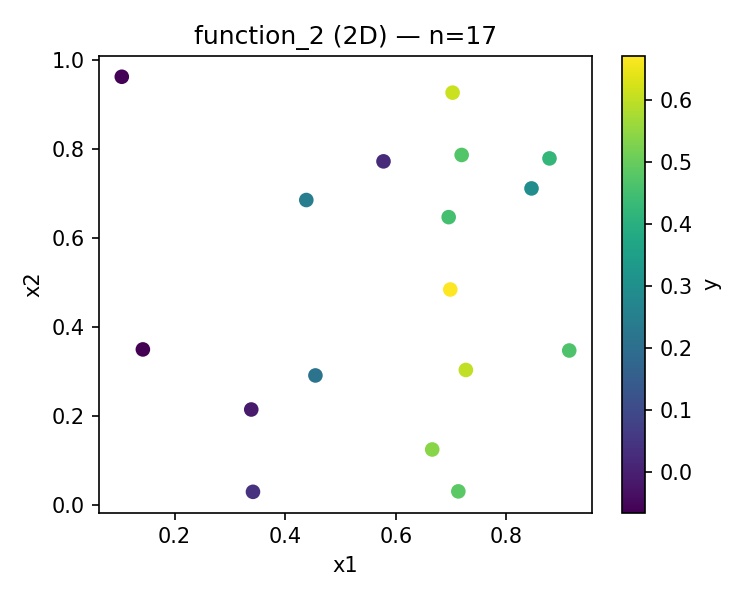
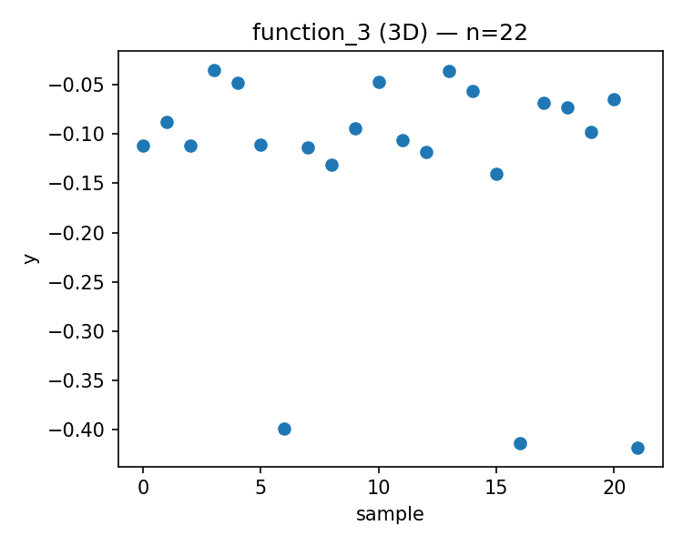
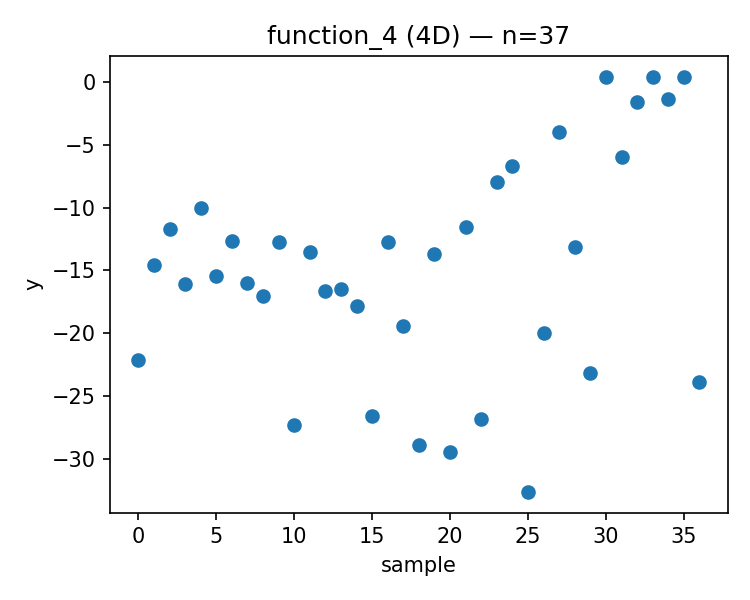
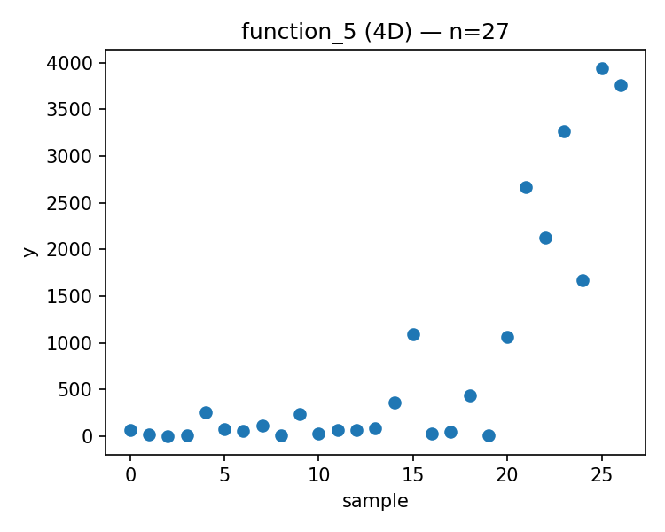
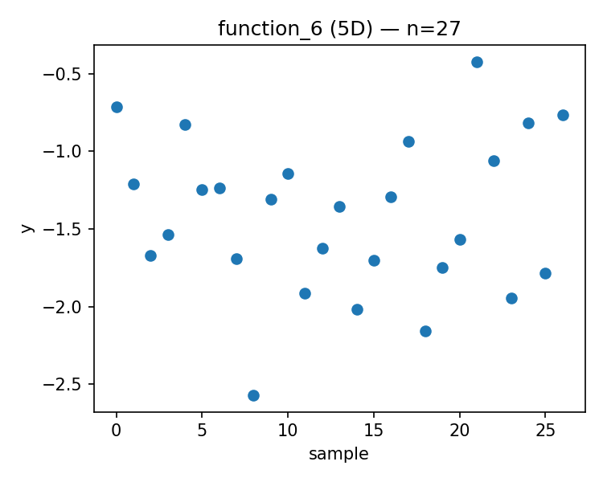
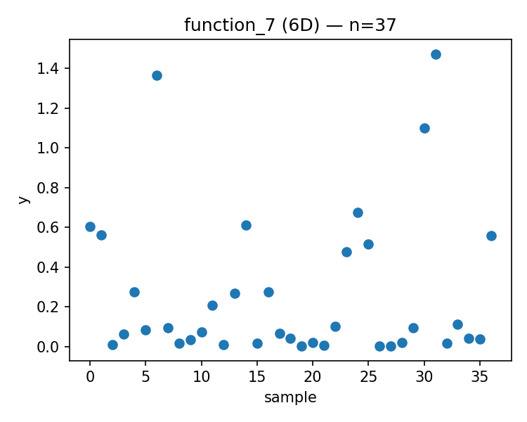
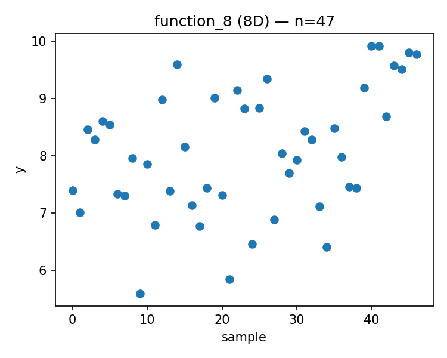

# Week 08 Report

Generated: 2025-12-09 23:47:32

## Proposed Points

### Function 1 (d=2, n=17)
- Current best: y = 0.000000
- Proposed x = [0.883612, 0.813937]
- 

### Function 2 (d=2, n=17)
- Current best: y = 0.670774
- Proposed x = [0.832105, 0.167066]
- 

### Function 3 (d=3, n=22)
- Current best: y = -0.034835
- Proposed x = [0.359106, 0.610099, 0.711990]
- 

### Function 4 (d=4, n=37)
- Current best: y = 0.404303
- Proposed x = [0.411016, 0.373112, 0.417866, 0.423893]
- 

### Function 5 (d=4, n=27)
- Current best: y = 3942.095977
- Proposed x = [0.860713, 0.865884, 0.916747, 0.993195]
- 

### Function 6 (d=5, n=27)
- Current best: y = -0.422192
- Proposed x = [0.680454, 0.554151, 0.573455, 0.988554, 0.263922]
- 

### Function 7 (d=6, n=37)
- Current best: y = 1.471711
- Proposed x = [0.794555, 0.749089, 0.795666, 0.617297, 0.424529, 0.815401]
- 

### Function 8 (d=8, n=47)
- Current best: y = 9.919041
- Proposed x = [0.027659, 0.168604, 0.019424, 0.096999, 0.973096, 0.097635, 0.148437, 0.102203]
- 

---

## Strategy Notes

See `strategy_overrides.json` for adaptive strategy parameters.
