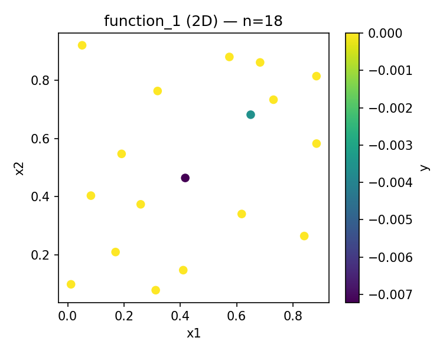
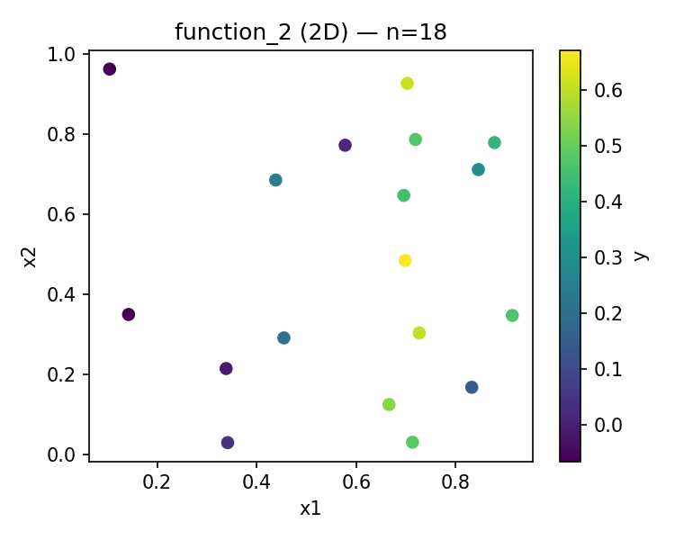
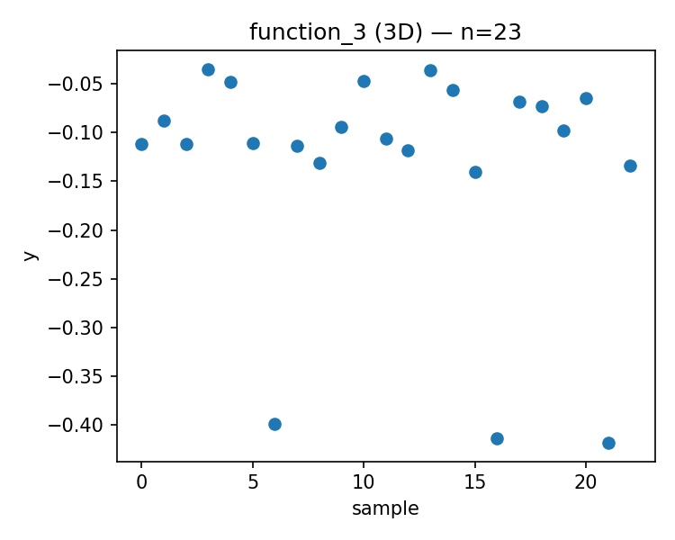
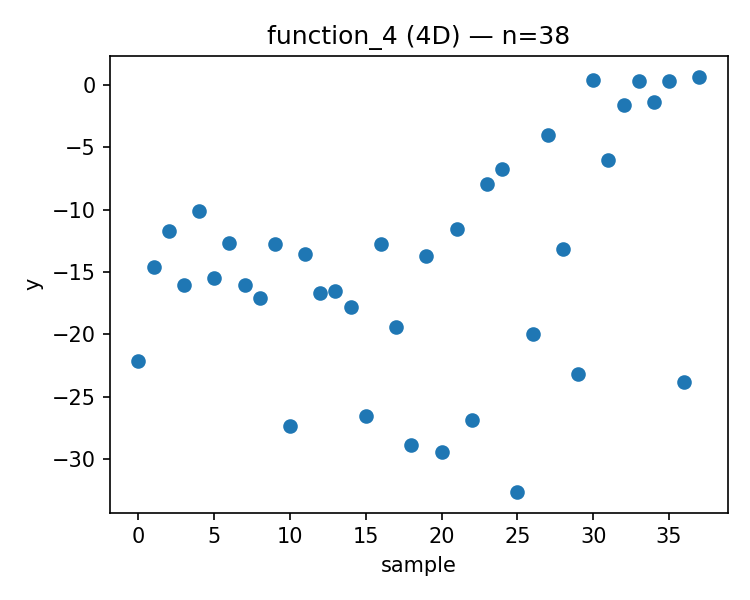
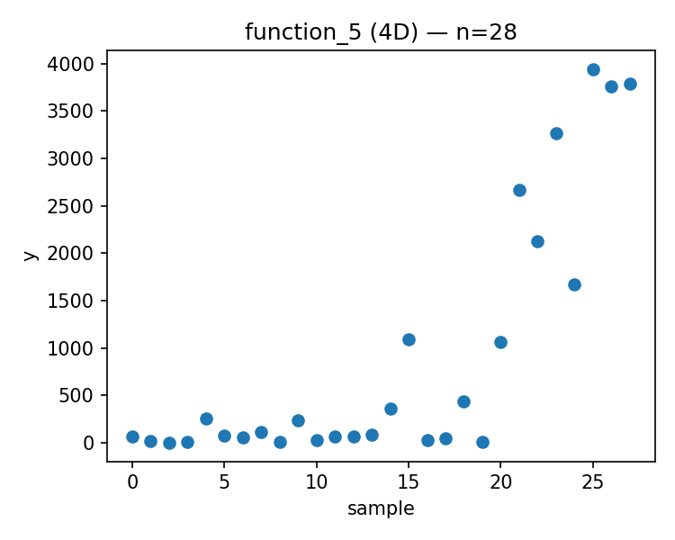
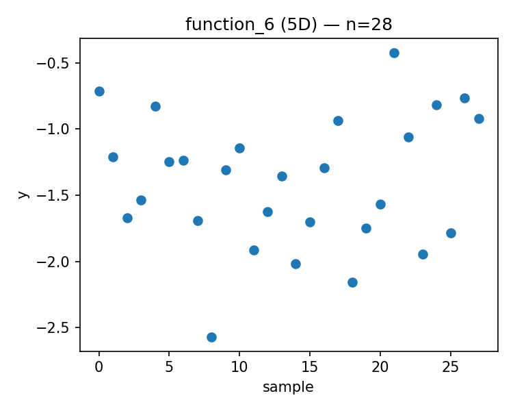
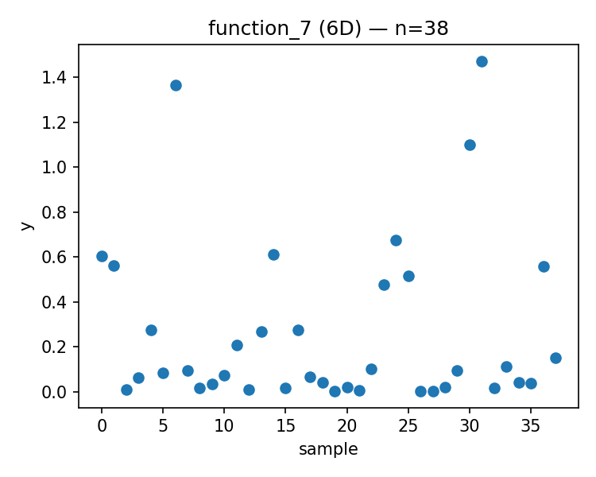
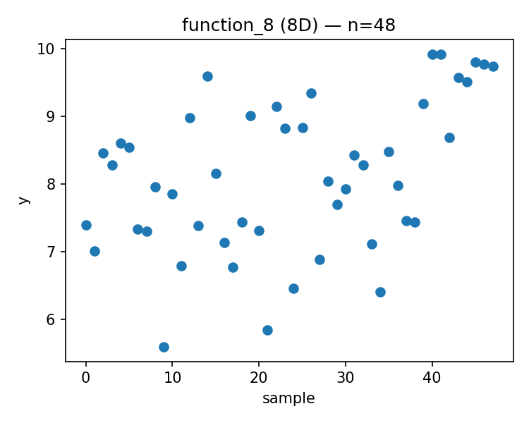

# Week 09 Report

Generated: 2025-12-12 00:43:46

## Proposed Points

### Function 1 (d=2, n=18)
- Current best: y = 0.000000
- Proposed x = [0.417053, 0.304321]
- 

### Function 2 (d=2, n=18)
- Current best: y = 0.670774
- Proposed x = [0.676737, 0.387513]
- 

### Function 3 (d=3, n=23)
- Current best: y = -0.034835
- Proposed x = [0.981678, 0.477268, 0.495450]
- 

### Function 4 (d=4, n=38)
- Current best: y = 0.669307
- Proposed x = [0.418581, 0.391933, 0.410405, 0.423914]
- 

### Function 5 (d=4, n=28)
- Current best: y = 3942.095977
- Proposed x = [0.845783, 0.878809, 0.927759, 0.996924]
- 

### Function 6 (d=5, n=28)
- Current best: y = -0.422192
- Proposed x = [0.036947, 0.341709, 0.019606, 0.989840, 0.119937]
- 

### Function 7 (d=6, n=38)
- Current best: y = 1.471711
- Proposed x = [0.065744, 0.888504, 0.010495, 0.167713, 0.461161, 0.760212]
- 

### Function 8 (d=8, n=48)
- Current best: y = 9.919041
- Proposed x = [0.228795, 0.457158, 0.265169, 0.039111, 0.930478, 0.466806, 0.157720, 0.372600]
- 

---

## Strategy Notes

See `strategy_overrides.json` for adaptive strategy parameters.
