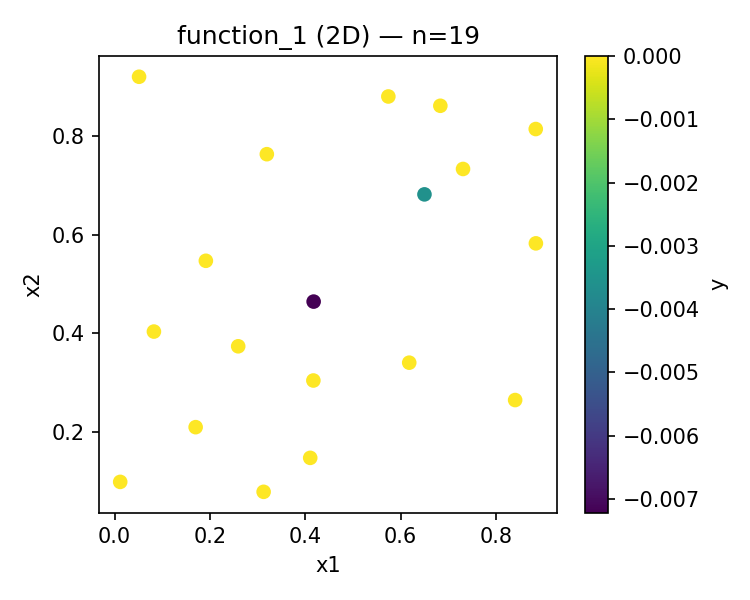
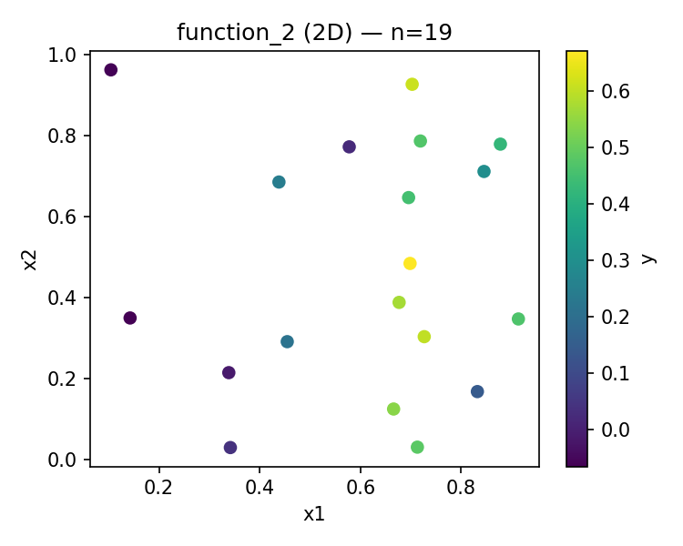
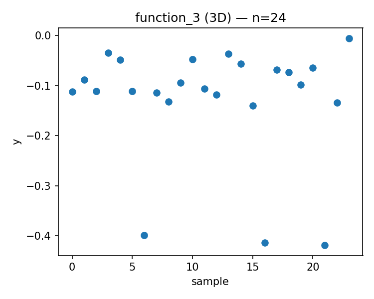
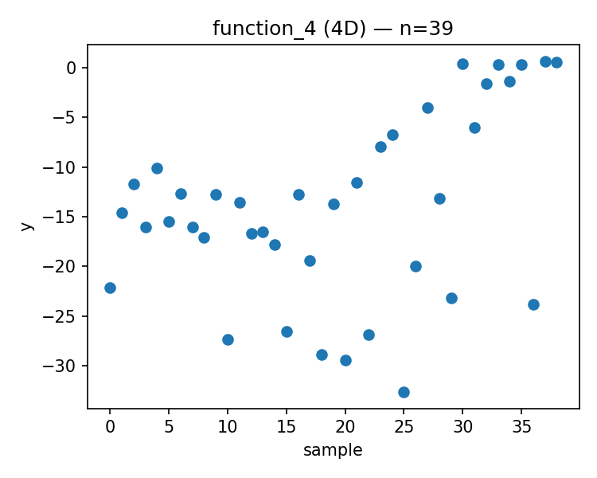
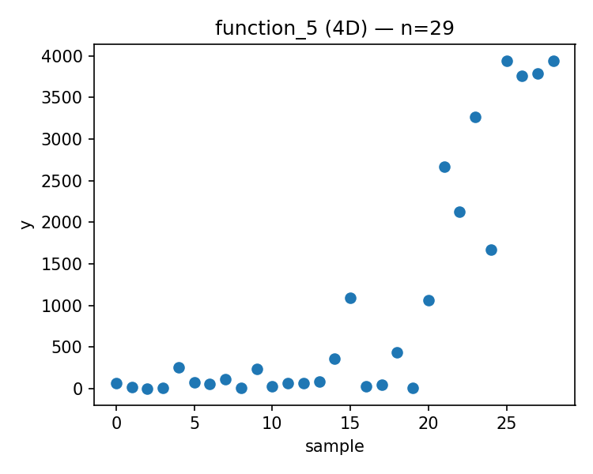
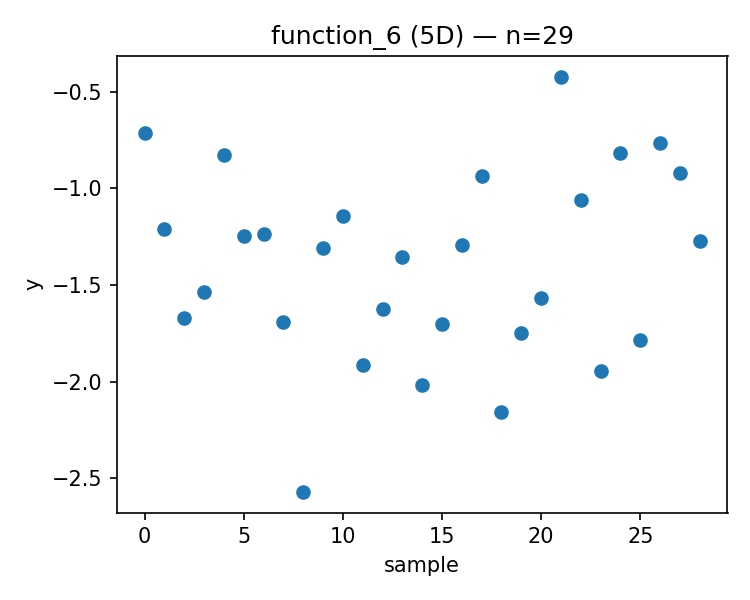
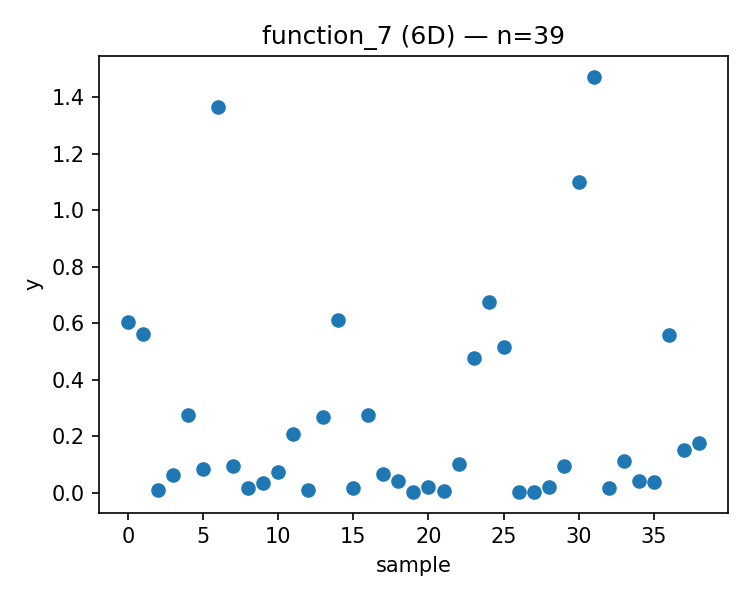
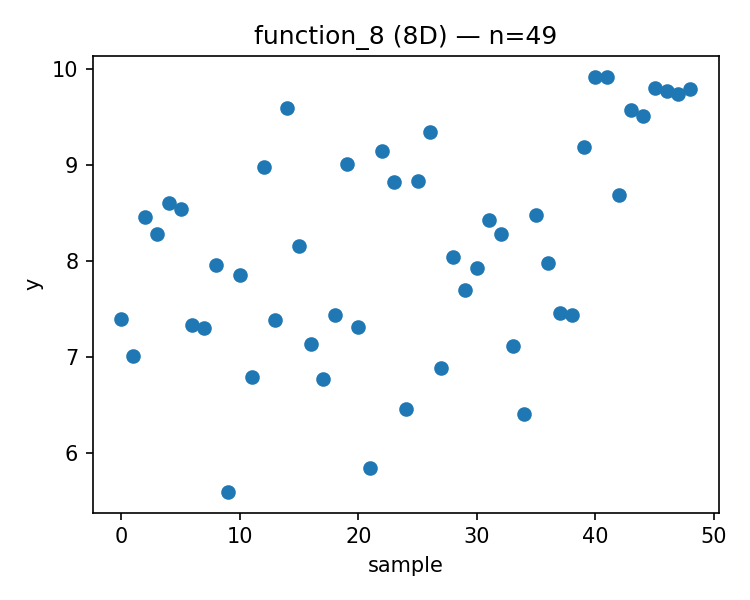

# Week 10 Report

Generated: 2025-12-15 00:22:50

## Proposed Points

### Function 1 (d=2, n=19)
- Current best: y = 0.000000
- Proposed x = [0.689794, 0.176574]
- 

### Function 2 (d=2, n=19)
- Current best: y = 0.670774
- Proposed x = [0.688012, 0.215770]
- 

### Function 3 (d=3, n=24)
- Current best: y = -0.005311
- Proposed x = [0.988268, 0.541196, 0.079876]
- 

### Function 4 (d=4, n=39)
- Current best: y = 0.669307
- Proposed x = [0.401505, 0.392240, 0.406616, 0.439730]
- 

### Function 5 (d=4, n=29)
- Current best: y = 3942.095977
- Proposed x = [0.853811, 0.887486, 0.908341, 0.992700]
- 

### Function 6 (d=5, n=29)
- Current best: y = -0.422192
- Proposed x = [0.149933, 0.570094, 0.042487, 0.512407, 0.348988]
- 

### Function 7 (d=6, n=39)
- Current best: y = 1.471711
- Proposed x = [0.397403, 0.183691, 0.190305, 0.573716, 0.417211, 0.734253]
- 

### Function 8 (d=8, n=49)
- Current best: y = 9.919041
- Proposed x = [0.019048, 0.121299, 0.101331, 0.161653, 0.961125, 0.510711, 0.178690, 0.396824]
- 

---

## Strategy Notes

See `strategy_overrides.json` for adaptive strategy parameters.
