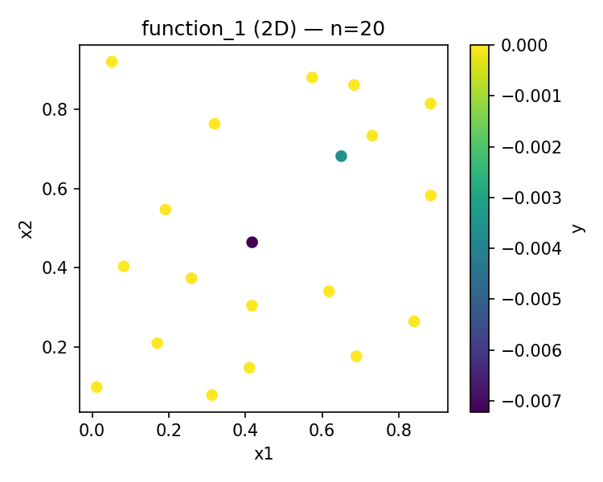
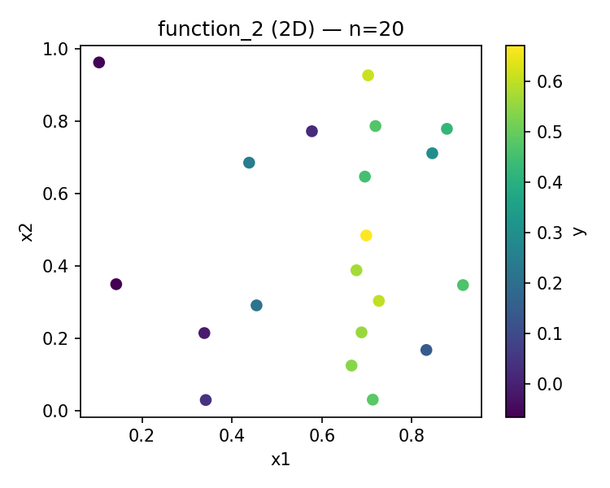
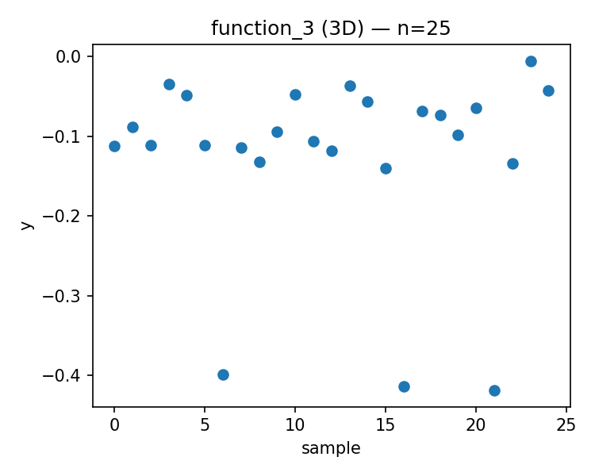
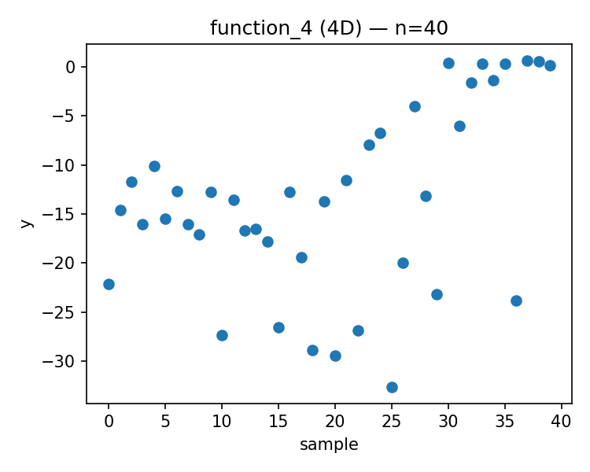
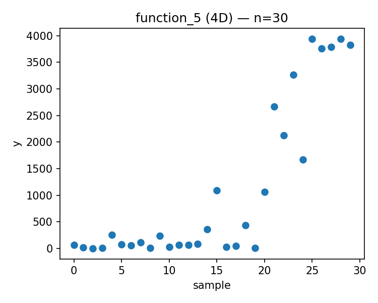
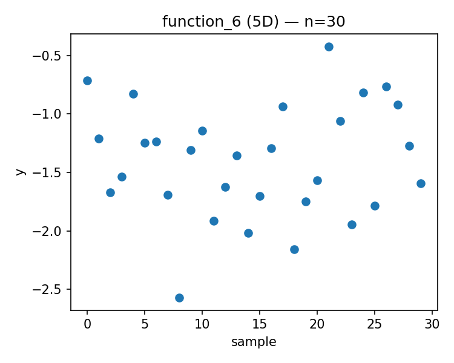
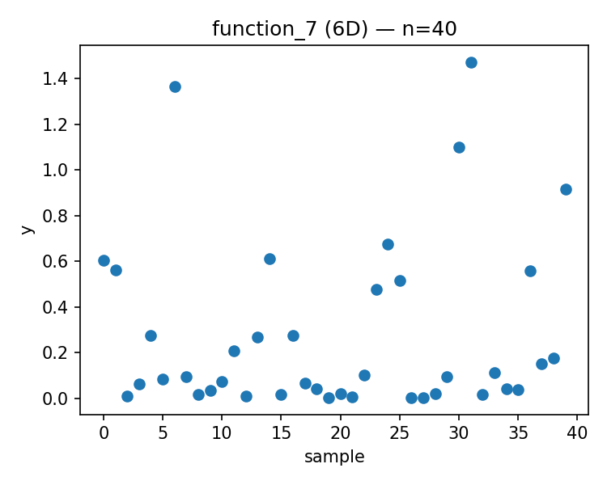
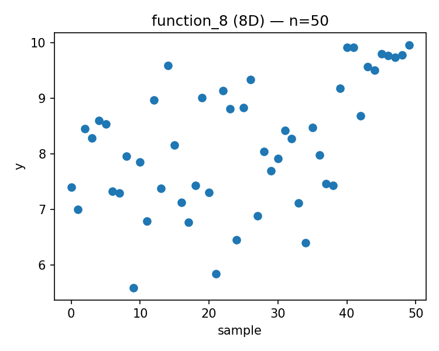

# Week 11 Report

Generated: 2025-12-22 00:11:58

## Proposed Points

### Function 1 (d=2, n=20)
- Current best: y = 0.000000
- Proposed x = [0.017617, 0.563236]
- 

### Function 2 (d=2, n=20)
- Current best: y = 0.670774
- Proposed x = [0.680886, 0.565477]
- 

### Function 3 (d=3, n=25)
- Current best: y = -0.005311
- Proposed x = [0.996845, 0.564071, 0.873864]
- 

### Function 4 (d=4, n=40)
- Current best: y = 0.669307
- Proposed x = [0.411016, 0.373112, 0.417866, 0.423893]
- 

### Function 5 (d=4, n=30)
- Current best: y = 3942.095977
- Proposed x = [0.858850, 0.891572, 0.936297, 0.990263]
- 

### Function 6 (d=5, n=30)
- Current best: y = -0.422192
- Proposed x = [0.637692, 0.334739, 0.688234, 0.991445, 0.005665]
- 

### Function 7 (d=6, n=40)
- Current best: y = 1.471711
- Proposed x = [0.072929, 0.905643, 0.905721, 0.413863, 0.582045, 0.799568]
- 

### Function 8 (d=8, n=50)
- Current best: y = 9.965337
- Proposed x = [0.057713, 0.006109, 0.033967, 0.606153, 0.895603, 0.716765, 0.236909, 0.305274]
- 

---

## Strategy Notes

See `strategy_overrides.json` for adaptive strategy parameters.
