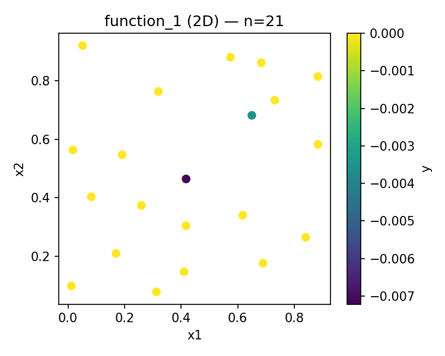
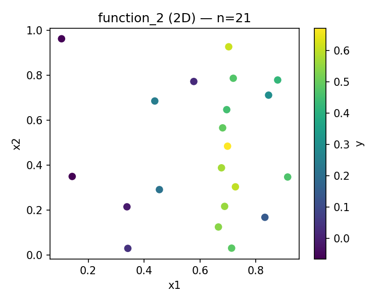
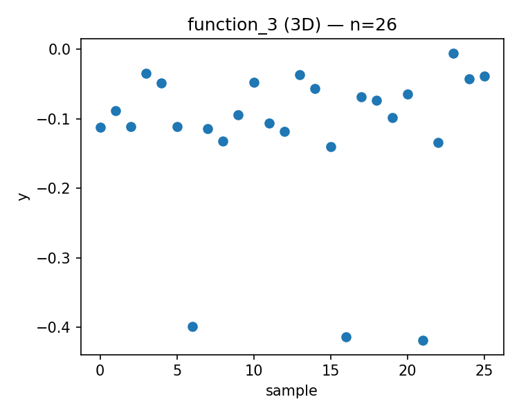
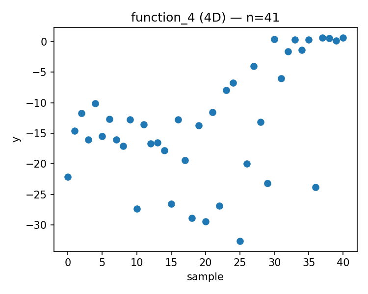
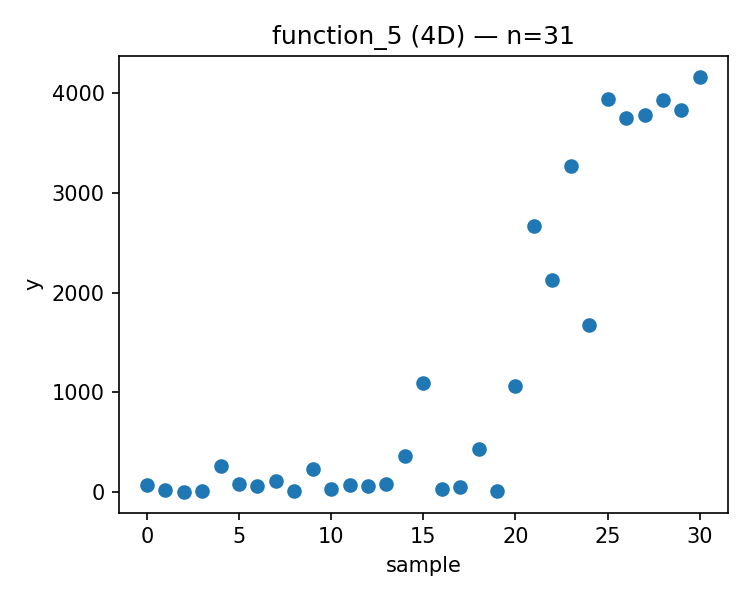
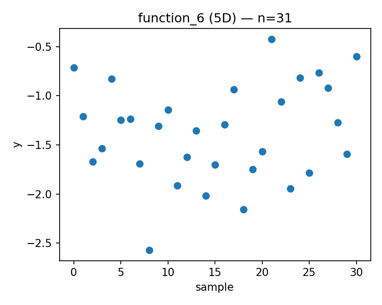
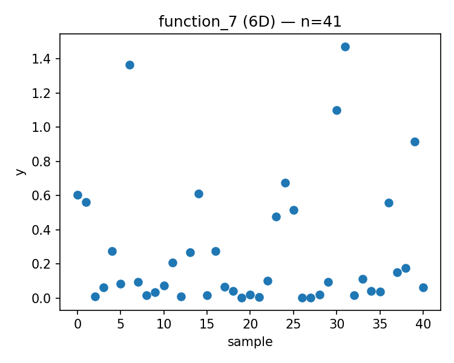
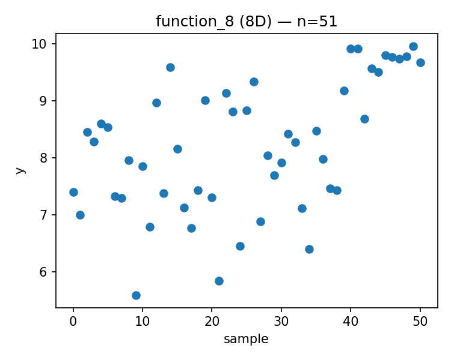

# Week 12 Report

Generated: 2026-01-14 01:08:48

## Proposed Points

### Function 1 (d=2, n=21)
- Current best: y = 0.000000
- Proposed x = [0.485551, 0.616612]
- 

### Function 2 (d=2, n=21)
- Current best: y = 0.670774
- Proposed x = [0.686411, 0.853620]
- 

### Function 3 (d=3, n=26)
- Current best: y = -0.005311
- Proposed x = [0.981162, 0.478861, 0.496367]
- 

### Function 4 (d=4, n=41)
- Current best: y = 0.669307
- Proposed x = [0.428774, 0.358554, 0.415570, 0.428699]
- 

### Function 5 (d=4, n=31)
- Current best: y = 4166.259413
- Proposed x = [0.825723, 0.887596, 0.927623, 0.998144]
- 

### Function 6 (d=5, n=31)
- Current best: y = -0.422192
- Proposed x = [0.261610, 0.342612, 0.641715, 0.656571, 0.170271]
- 

### Function 7 (d=6, n=41)
- Current best: y = 1.471711
- Proposed x = [0.082685, 0.402963, 0.391434, 0.748362, 0.349861, 0.791751]
- 

### Function 8 (d=8, n=51)
- Current best: y = 9.965337
- Proposed x = [0.079598, 0.247701, 0.038083, 0.358249, 0.963172, 0.441485, 0.379581, 0.911333]
- 

---

## Strategy Notes

See `strategy_overrides.json` for adaptive strategy parameters.
